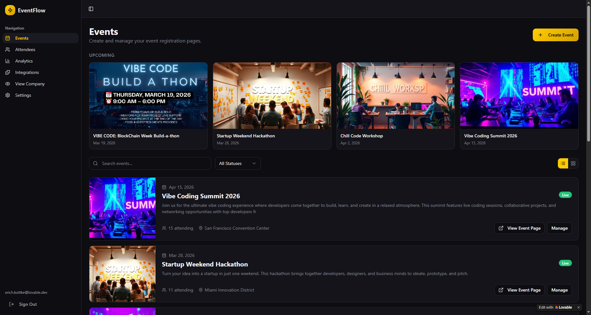
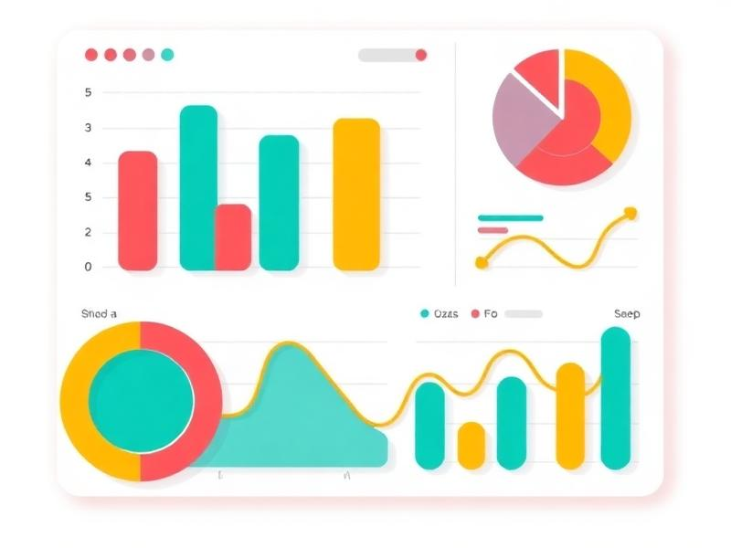

<div align="center">

# 🎆 Events Spark App
*The modern platform for creating, managing, and discovering unforgettable events*


[](https://www.typescriptlang.org/)
[](https://reactjs.org/)
[](https://tailwindcss.com/)
[](https://supabase.com/)

</div>

## ✨ Features

### 🎯 Event Management
- **Create Stunning Events** with rich media support (images, videos, YouTube/Vimeo embeds)
- **Advanced Media Upload** with drag-and-drop interface and video poster extraction
- **Custom Event Pages** with beautiful, responsive designs
- **Event Templates** for quick setup of common event types

### 📊 Analytics & Insights
- **Real-time Analytics** dashboard with comprehensive event metrics
- **Attendee Management** with check-in capabilities
- **Revenue Tracking** and performance insights
- **Interactive Charts** powered by Recharts

### 🔍 Discovery & Engagement
- **Public Event Discovery** platform
- **Company Profiles** showcasing organizations
- **Calendar Integration** for seamless scheduling
- **Social Features** for event sharing and engagement

### 🛠️ Developer Experience
- **TypeScript First** for type-safe development
- **Component Library** built with shadcn/ui and Radix UI
- **Modern Tooling** with Vite, ESLint, and Vitest
- **Responsive Design** with Tailwind CSS

## 🚀 Quick Start

### Prerequisites
- Node.js 18+ 
- npm or yarn
- Supabase account (for backend services)

### Installation

```bash
# Clone the repository
git clone https://github.com/your-username/events-spark-app.git
cd events-spark-app

# Install dependencies
npm install

# Set up environment variables
cp .env.example .env
# Edit .env with your Supabase credentials

# Start the development server
npm run dev
```

Open [http://localhost:5173](http://localhost:5173) to view the application.

## 🏗️ Architecture

### Tech Stack
- **Frontend**: React 18 + TypeScript + Vite
- **UI Components**: shadcn/ui + Radix UI + Tailwind CSS
- **Backend**: Supabase (Database, Auth, Storage)
- **State Management**: TanStack Query
- **Routing**: React Router DOM
- **Forms**: React Hook Form + Zod
- **Animations**: Framer Motion
- **Media**: Cloudinary (stubbable)

### Project Structure
```
src/
├── components/          # Reusable UI components
│   ├── event-creation/  # Event creation components
│   ├── event-detail/    # Event detail views
│   ├── event-public/    # Public event components
│   ├── layout/          # Layout components
│   └── ui/              # shadcn/ui components
├── pages/               # Route components
│   ├── dashboard/       # Protected dashboard
│   └── [public]         # Public pages
├── lib/                 # Utilities & constants
├── hooks/               # Custom React hooks
├── contexts/            # React contexts
└── assets/              # Images & media
```

## 🎨 UI Components

### Media Upload Zone
Advanced media handling component supporting:
- **Image Upload** with drag-and-drop
- **Video Upload** with automatic poster extraction
- **URL Embeds** for YouTube and Vimeo
- **File Validation** and size limits

### Dashboard Layout
Comprehensive dashboard featuring:
- **Event Management** interface
- **Analytics Dashboard** with charts
- **Attendee Management** system
- **Settings & Integrations**

## 📱 Screenshots

### Event Creation


### Analytics Dashboard


### Attendee Management


## 🔧 Configuration

### Environment Variables
Create a `.env` file with:
```env
VITE_SUPABASE_URL=your_supabase_url
VITE_SUPABASE_ANON_KEY=your_supabase_anon_key
VITE_CLOUDINARY_CLOUD_NAME=your_cloudinary_name
VITE_GOOGLE_MAPS_API_KEY=your_google_maps_api_key
```

### Supabase Setup
1. Create a new Supabase project
2. Run the migration scripts from `supabase/migrations/`
3. Set up authentication providers
4. Configure storage buckets for media uploads

## 🧪 Testing

```bash
# Run tests
npm test

# Run tests in watch mode
npm run test:watch

# Run linting
npm run lint
```

## 📦 Build & Deploy

```bash
# Build for production
npm run build

# Build for development
npm run build:dev

# Preview production build
npm run preview
```

### Deployment Options
- **Vercel** - Zero-config deployment
- **Netlify** - Static site hosting
- **AWS Amplify** - Full-stack hosting
- **Docker** - Containerized deployment

## 🤝 Contributing

1. Fork the repository
2. Create a feature branch (`git checkout -b feature/amazing-feature`)
3. Commit your changes (`git commit -m 'Add some amazing feature'`)
4. Push to the branch (`git push origin feature/amazing-feature`)
5. Open a Pull Request

## 📄 License

This project is licensed under the MIT License - see the [LICENSE](LICENSE) file for details.

## 🙏 Acknowledgments

- [shadcn/ui](https://ui.shadcn.com/) for beautiful UI components
- [Supabase](https://supabase.com/) for the backend infrastructure
- [Vite](https://vitejs.dev/) for the blazing-fast build tool
- [Tailwind CSS](https://tailwindcss.com/) for utility-first styling

## 📞 Support

- 📧 Email: support@eventsspark.com
- 🐛 Issues: [GitHub Issues](https://github.com/your-username/events-spark-app/issues)
- 📖 Documentation: [Wiki](https://github.com/your-username/events-spark-app/wiki)

---

<div align="center">
Made with ❤️ by the Events Spark Team
</div>
